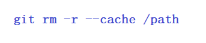

# Git rm

Remove the folder and its contents from your local repository using "git rm" with the "-r" option:

<p align="center">

</p>


### Command
This will remove the folder and all its contents from your local repository.
```bash
git rm -r --cached path/to/folder
```

