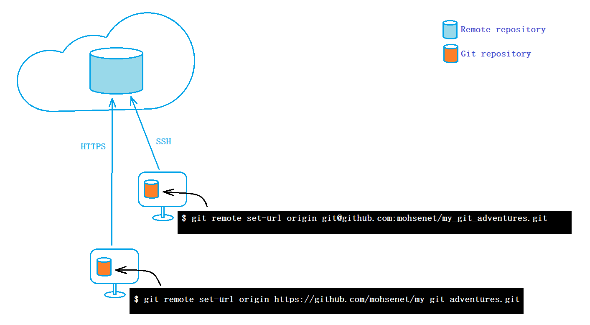

# There are two ways to set the remote URL for a Git repository

You can set the URL type(HTTPS & SSH) for the origin of a remote repository in a Git repository.
Here are two ways to push your project to your Git repository.

<p align="center">

</p>


### 1- push by HTTPS
If you want to push your project over HTTPS, you should set the following remote URL.
```bash
git remote set-url origin https://github.com/mohsenet/my_git_adventures.git
```
### 2- push by SSH
If you want to push your project via SSH, you should set the following remote URL.
```bash
git remote set-url origin git@github.com:mohsenet/my_git_adventures.git
```
